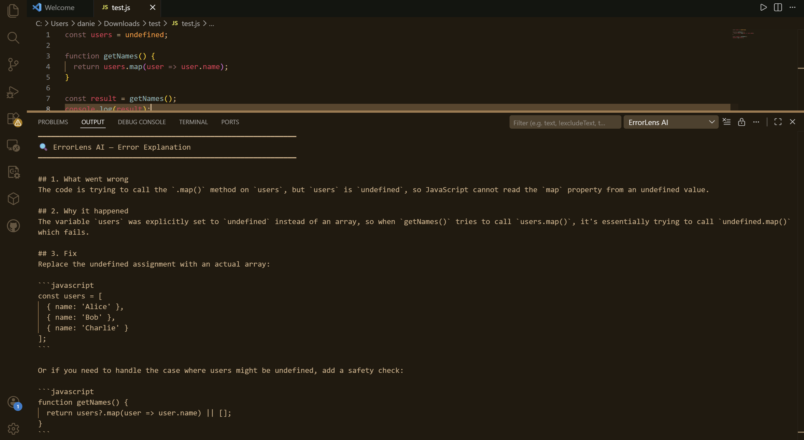

# ErrorLens AI

> A VS Code extension that explains your errors in the context of your actual code — not generic Stack Overflow answers.

**[Live Demo](http://3.14.146.94/errorlens/)** · **[GitHub](https://github.com/DanielAguilar112/errorlens-ai)**

---

## Why I built this

I kept hitting errors, copying them into ChatGPT, re-explaining my entire codebase, and getting back advice that didn't quite fit. I wanted something that already knew my code and could just tell me what went wrong and how to fix it — without leaving my editor.

## What it does

ErrorLens AI reads both your error message and your open file, then gives you a specific explanation that references your actual variable names, line numbers, and logic.

**Without ErrorLens AI:**
1. Hit error
2. Google it
3. Find a Stack Overflow answer from 2015
4. Try to adapt generic advice to your specific code
5. Repeat

**With ErrorLens AI:**
1. Hit error
2. Run one command
3. Get a specific fix for your exact code

## Demo



## Example output

```
## What went wrong
The code is trying to call `.map()` on `users`, but `users` is `undefined` on line 1.

## Why it happened
The `users` variable was never initialized — likely a failed API call or missing prop.

## Fix
const users = data?.users ?? [];
```

## Installation

1. Clone the repo
   ```bash
   git clone https://github.com/DanielAguilar112/errorlens-ai.git
   cd errorlens-ai
   npm install
   ```

2. Open in VS Code
   ```bash
   code .
   ```

3. Press `F5` to launch the extension in a new window

4. Go to **Settings** → search `errorlensAi` → paste your [Anthropic API key](https://console.anthropic.com)

## Usage

1. Open any file with an error
2. Press `Ctrl+Shift+P`
3. Run **ErrorLens AI: Explain Error**
4. Get a specific explanation instantly

Enable auto-explain in settings to trigger automatically when errors appear.

## Built with

- VS Code Extension API
- Claude Sonnet (Anthropic)
- TypeScript
- esbuild

## License

MIT